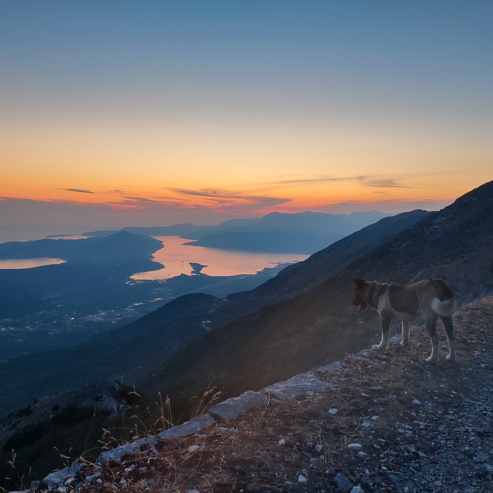

## Hi there I'm Vesko :wave: Welcome to the realm of Data engineering.

```My passion is data and everything related to data. In this blog, you can read about distributed systems, data-intensive applications, deep learning, and many other topics that are related to these above mentioned domains.```

I'm from [Montenegro](https://www.youtube.com/watch?v=ksRoiNKNMFM&ab_channel=HANGOVERCOMMUNITY) :montenegro:, a small Mediterranean country. I live in a town called [Cetinje](https://sh.wikipedia.org/wiki/Cetinje). When I'm not behind my keyboard I'm probably walking my dog :dog: American Akita somewhere in the mountains or trying to master some new dish. I'm a huge fan of this breed :blush:. Besides these things, I also enjoy playing the guitar and collecting new vinyls.




