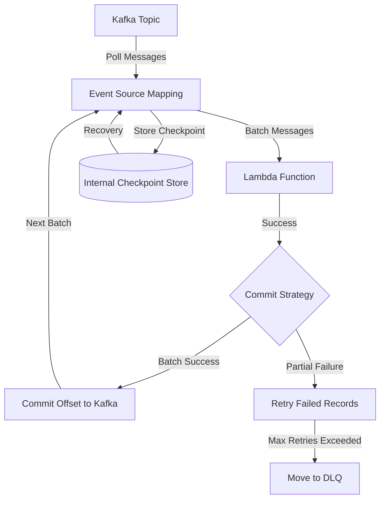

## Introduction

When building event-driven architectures with AWS Lambda and Apache Kafka, one of the most critical yet often misunderstood components is offset management especially for event source mapping when you use lambda functions. 

Many developers wonder: **Do I need to manage Kafka offsets manually?** or **What happens when my consumer group's offsets expire?** 

In this blog post, we'll demystify how AWS Lambda's Event Source Mapping handles Kafka offsets automatically and what you actually need to know as a developer.

## Understanding the Architecture

Before diving into the details, let's visualize how Lambda Event Source Mapping works with Kafka:

