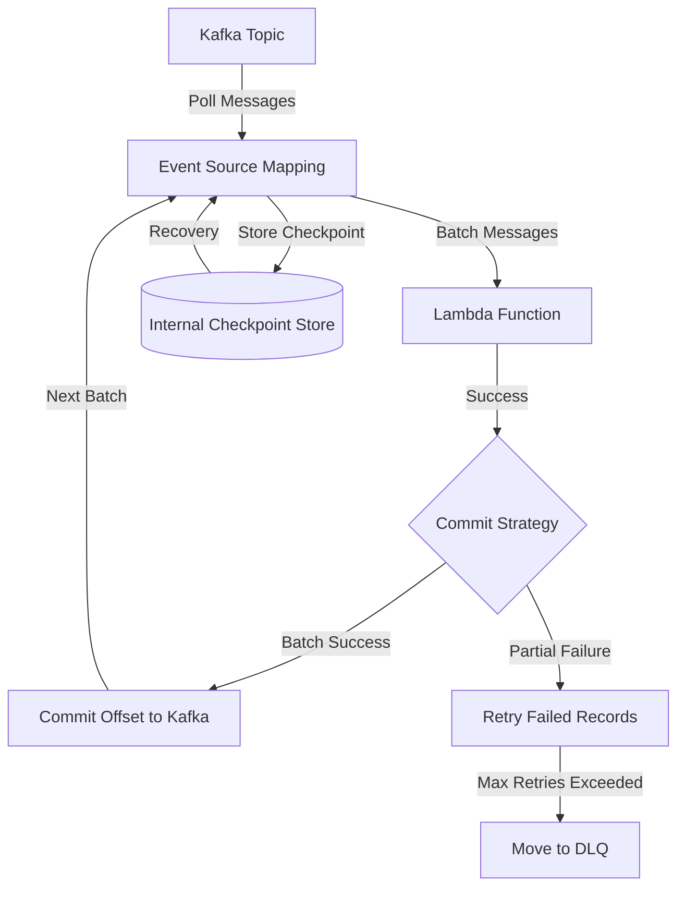

## Introduction

When building event-driven architectures with AWS Lambda and Apache Kafka, one of the most critical yet often misunderstood components is offset management especially for event source mapping when you use lambda functions. 

Many developers wonder: **Do I need to manage Kafka offsets manually?** or **What happens when my consumer group's offsets expire?** 

In this blog post, we'll demystify how AWS Lambda's Event Source Mapping handles Kafka offsets automatically and what you actually need to know as a developer.

## Understanding the Architecture


Before diving into the details, let's visualize how Lambda Event Source Mapping works with Kafka:




## The Magic of Automatic Offset Management


### 1. Initial Setup & Configuration

Let's start with a basic Event Source Mapping configuration:

```yaml
Resources:
  KafkaEventSourceMapping:
    Type: AWS::Lambda::EventSourceMapping
    Properties:
      FunctionName: !Ref MyLambdaFunction
      StartingPosition: TRIM_HORIZON  # or LATEST
      BatchSize: 100
      MaximumBatchingWindowInSeconds: 30
      ParallelizationFactor: 1
      MaximumRecordAgeInSeconds: 604800  # 7 days
      MaximumRetryAttempts: 2
      DestinationConfig:
        OnFailure:
          Destination: !Ref DLQArn
      KafkaConfiguration:
        AutoOffsetReset: "earliest"
```



So let's refresh our memory how lambda is commiting offsets :brain: From my previous blog on [event-source-mapping](https://blog.veskovujovic.me/posts/event-source-mapping-and-lambda-scaling/) we said 🗣️:

> Whenever lambda finishes with status code 200, the offset will be committed automatically for the kafka topic.


After refreshing our memory we can create a summary of the things that ESM does for us. 


### 2. What Happens Behind the Scenes?

Lambda's Event Source Mapping acts as a sophisticated Kafka consumer that handles several complex operations automatically:

1. **Consumer Group Management**
   - Creates and manages consumer groups
   - Handles partition assignments
   - Manages group coordination

2. **Offset Tracking**
   - Maintains internal checkpoints
   - Handles offset commits automatically
   - Manages recovery scenarios

3. **Error Handling**
   - Implements retry logic
   - Routes failed messages to DLQ
   - Manages partial batch failures


## Key Features You Get Out of the Box

### 1. Automatic Checkpoint Storage

Lambda maintains its own checkpoint system for reliability. Think of it as an internal conversation that goes something like this (this is just a pseudocode):

```python
# This happens automatically inside Lambda
def internal_offset_management():
    try:
        messages = poll_kafka()
        process_batch(messages)
        commit_offset()  # Automatic
    except Exception:
        handle_retry()  # Automatic retry logic
```


### 2. Smart Recovery Mechanisms

When offsets expire or become invalid, Lambda implements smart recovery:

```python
# Internal Lambda Logic (simplified)
def handle_offset_expiry():
    if consumer_grpup_exists and offset_exists:
        resume_from_last_checkpoint()
    elif starting_position == "TRIM_HORIZON":
        start_from_earliest()
    else:  # LATEST
        start_from_newest()
```


## What You Need to Do vs. What's Handled Automatically

### Handled Automatically by Lambda:
- ✅ Offset commits
- ✅ Checkpoint storage
- ✅ Consumer group management
- ✅ Partition rebalancing
- ✅ Basic error retries
- ✅ DLQ routing


### Your Responsibilities:
1. **Proper Configuration**:
   ```yaml
   Properties:
     # Critical data? Start from beginning
     StartingPosition: TRIM_HORIZON
     
     # Tune based on your needs
     BatchSize: 100
     MaximumBatchingWindowInSeconds: 30
     
     # Configure appropriate retry behavior
     MaximumRetryAttempts: 2
   ```


2. **Monitoring Implementation**:
   ```python
   def lambda_handler(event, context):
       metrics = {
           'BatchSize': len(event['records']),
           'ProcessingTime': process_time,
           'FailedRecords': failed_count
       }
       publish_metrics(metrics)
   ```

3. **Business Logic Error Handling**:
   ```python
   def lambda_handler(event, context):
       failed_records = []
       for record in event['records']:
           try:
               process_record(record)
           except Exception as e:
               failed_records.append({
                   'recordIdentifier': record['recordIdentifier'],
                   'error': str(e)
               })
       return {'batchItemFailures': failed_records}
   ```


## Best Practices and Recommendations

### 1. Configuration Best Practices
- Set appropriate batch sizes based on message processing time
- Configure retry attempts based on business requirements
- Always implement a DLQ for failed messages
- Use TRIM_HORIZON for critical data processing

### 2. Monitoring Essentials
- Track consumer lag
- Monitor processing errors
- Watch DLQ messages
- Measure processing latency

### 3. Error Handling Strategy
- Implement proper error categorization
- Log sufficient context for debugging
- Handle partial batch failures appropriately
- Monitor retry patterns

## Limitations to Keep in Mind

1. **Fixed Behaviors**:
   - Can't manually control offset commits
   - Fixed retry behavior patterns
   - Limited consumer group customization
   - No custom partition assignment strategies

2. **Configuration Constraints**:
   - Maximum batch size limits
   - Fixed scaling patterns
   - Predetermined retry policies


## One detail worth **milions of dollars** 💵💵💵

When you have a consumer group on kafka (our lambda function) that wasn't active for more then a *week* what happens with commited offsets on kafka? 


**Kafka will delete commited offsets depending on offsets.retention.minutes setting on kafka broker if you consumer is inactive for more than 7 days.** More info [here](https://docs.confluent.io/platform/current/installation/configuration/broker-configs.html)

### So how does AWS Lamnda knows from where to start then? 

Is it starting from **latest records** or because it's has it's own consumer group commited offsets erased starting from begining of the topic (if your pipeline isn't **idempotent** this would be a major blow to your data? 

From my hands on experience with this case and reading the AWS documentation we can say this

> **If offsets are expired AWS Lambda will start from StartingPosition that you defined when deploying your lambda, if they are not expired it will resume from last commited offset.**

Excerpt from the documentation:

> Additionally, if you specify a consumer group ID, and Kafka finds a valid existing consumer group with the same ID, Lambda ignores the StartingPosition parameter for your event source mapping. Instead, Lambda begins processing records according to the committed offset of the consumer group. If you specify a consumer group ID, and Kafka cannot find an existing consumer group, then Lambda configures your event source with the specified StartingPosition.

Especially focus on this part of the text:

>**If you specify a consumer group ID, and Kafka cannot find an existing consumer group, then Lambda configures your event source with the specified StartingPosition.**


## Conclusion

Understanding how AWS Lambda's Event Source Mapping handles Kafka offsets is crucial for building reliable event-driven architectures. While Lambda abstracts away much of the complexity of offset management, being aware of its behavior—especially regarding offset retention and recovery—can save you from potential data processing issues. 

The automatic offset management, combined with the **StartingPosition** configuration, provides a robust foundation for handling both active and inactive consumer groups. However, the real power lies in knowing what's handled automatically versus what requires your attention.

By following the best practices outlined in this post, properly configuring your Event Source Mapping, and implementing comprehensive monitoring and error handling, you can build resilient Kafka-Lambda integrations that handle message processing reliably, even after extended periods of inactivity. Remember, when it comes to offset management in Lambda, the magic happens automatically, but understanding the mechanics behind it is worth its weight in gold—or 💰💰💰 in this case, millions of dollars in prevented data processing issues. :smile:


